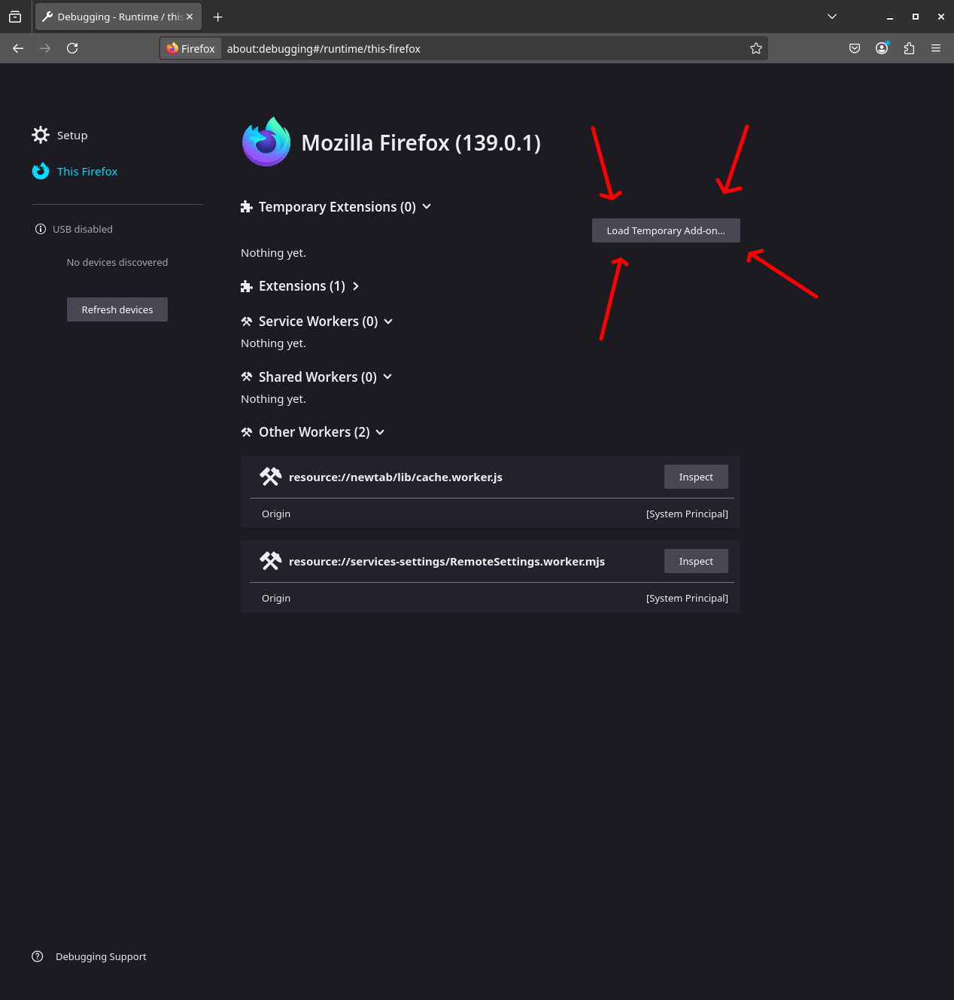

# SAQ Metrics Extension

Si vous cherchez la version française de ce README, [cliquez ici](README_FR.md)

A simple browser extension that adds some really important metrics to the product page of a product.

## Installation

To your right, you will see the release tab. Click on the version you wish to install and download the .zip. Then extract it and follow the step depending on your browser.

### Chrome
Enter `chrome://extensions/` in your navbar, then activate the developer mode and click on the `Load unpacked` button and select the extracted folder.

### Firefox
Enter `about:debugging#/runtime/this-firefox` in your navbar, then click on the `Load Temporary Add-on` button and select the extracted folder.

## Build

1. Clone the project
2. Install Node
3. run `npm install`
4. run `npm run build` to generate the `dist` folder. Install it as a temporary add-on
5. If you wish to package it, run `npm run package`

## Disclaimers

### Non-affiliation

Neither I nor any potential contributor is associated with the Société des alcools du Québec (SAQ) or any of its subsidiaries. The same goes for the Quebec government, which has no connection with us. The SAQ neither condemns nor supports this extension, which is purely a figment of my imagination.

### Alcohol

This extension is a simple little project. I in no way encourage the consumption of alcohol, especially not excessively. Alcohol is actually very bad for your health.

If you have any issues with addiction, whether to alcohol or other drugs, please refer to

1. If you are in Quebec, [Drogue: aide et référence](https://www.aidedrogue.ca/).
2. If you are located elsewhere in Canada, [the Canadian government's page on the subject](https://www.canada.ca/en/health-canada/services/substance-use/get-help-with-substance-use.html).

## License

This project is licensed under the **Licence Libre du Québec – Permissive version 1.1** or `LiLiQ-P-1.1` for short, which is one of the license officially recognized by Quebec's government as well as by the Open Source Initiative.

The English version of this license, which is not official can be found on the [LICENSE_EN](LICENSE_EN) file. The real license is the [French one](LICENSE)
