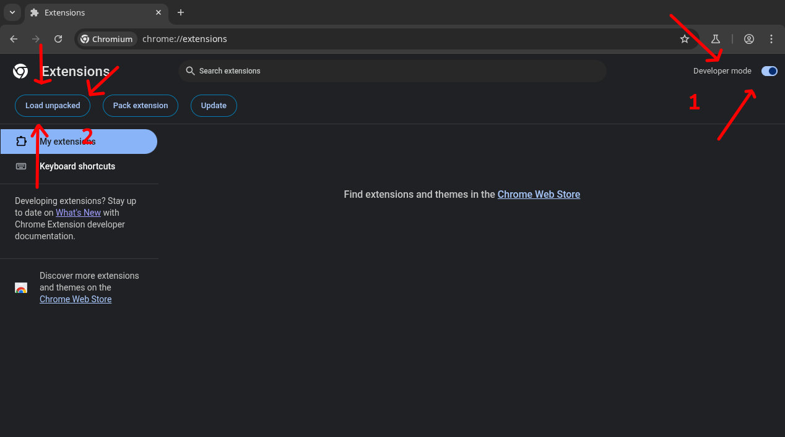

# Extension des métriques de la SAQ

Une simple extension de navigateur qui ajoute des métriques supplémentaires à la page d'un produit sur le site de la SAQ.

## Installation

À votre droite, vous verrez l'onglet des *releases*. Cliquez sur la version que vous souhaitez installer et téléchargez le fichier .zip. Ensuite, extrayez-le et suivez les étapes en fonction de votre navigateur.

### Chrome
Entrez `chrome://extensions/` dans votre barre de navigation, puis activez le mode développeur et cliquez sur le bouton `Load unpacked` et sélectionnez le dossier extrait.

### Firefox
Entrez `about:debugging#/runtime/this-firefox` dans votre barre de navigation, puis cliquez sur le bouton `Load Temporary Add-on` et sélectionnez le dossier extrait.

## Construction

1. Clonez le projet
2. Installer Node
3. exécuter `npm install`
4. exécuter `npm run build` pour générer le dossier `dist`. Installez-le en tant que module complémentaire temporaire
5. Si vous souhaitez l'empaqueter, exécutez `npm run package`

## Avis de non-responsabilité

### Non-affiliation

Ni moi ni aucun contributeur potentiel n'est associé à la Société des alcools du Québec (SAQ) ou à l'une de ses filiales. Il en va de même pour le gouvernement du Québec, qui n'a aucun lien avec nous. La SAQ ne condamne ni n'appuie cette extension qui n'est que le fruit de mon imagination.

#### Alcool

Cette extension est un simple petit projet. Je n'encourage aucunement la consommation d'alcool, surtout pas de façon excessive. L'alcool est en fait très mauvais pour la santé.

Si vous avez des problèmes d'addiction, que ce soit à l'alcool ou à d'autres drogues, veuillez vous référer à

1. Si vous êtes au Québec, [Drogue : aide et référence] (https://www.aidedrogue.ca/).
2. Si vous êtes situé ailleurs au Canada, [la page du gouvernement canadien sur le sujet](https://www.canada.ca/fr/sante-canada/services/dependance-aux-drogues/obtenez-aide-concernant-consommation-substances.html).
